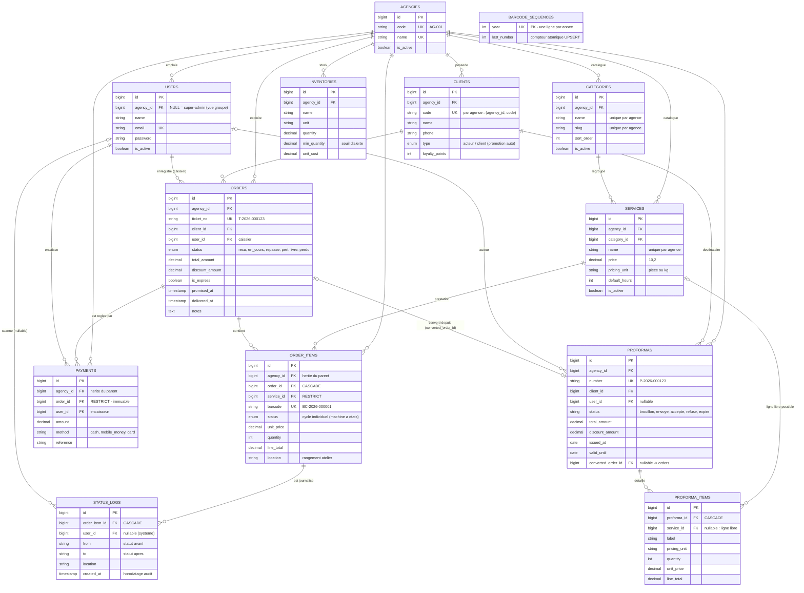

# 📋 RAPPORT PROJET — PRESSING PRO

> **⚠️ INSTRUCTIONS POUR L'IA :** ce fichier est la MÉMOIRE DU PROJET.
> Lis-le EN ENTIER avant toute modification du code. Il décrit l'architecture,
> les conventions et les règles métier. Respecte-les. Après chaque mise à jour
> du projet, mets ce fichier à jour (date, versions, fonctionnalités, tests).
> **Dernière mise à jour : 2026-09-15** — par Buffy (Freebuff) :
> inscription self-service (compte + première agence), export PDF des rapports,
> **propriétaire de groupe** (agencies.owner_id : le client inscrit ajoute des
> agences et gère ses utilisateurs) et formulaire register 2 colonnes.

---

## 1. Vue d'ensemble

**Pressing Pro** — application web de gestion pour pressing / blanchisserie
(dépôts de linge, suivi atelier, encaissements, rapports), **multi-agences**
(multi-tenant).

| Élément | Valeur |
|---|---|
| Framework | Laravel 12 (PHP 8.2+), monolithe MVC classique |
| Base de données | SQLite en dev (`database/database.sqlite`), portable MySQL |
| Front-end | Blade + Tailwind CSS v4 (compilé SANS Node.js — binaire standalone) + Alpine.js |
| Authentification | Session Laravel + rôles **spatie/laravel-permission** |
| Tests | PHPUnit 11 — `php artisan test` (**41 tests / 153 assertions, tous verts**) |
| Assets | `public/assets/` vendorisé (Alpine, Lucide), zéro npm/Vite |
| Langue UI | Français |

### Concepts métier essentiels
- **Dépôt** = commande (`orders`) : le client confie des articles au pressing.
- **Ticket** = `T-<année>-<ID 6 chiffres>` (ex : `T-2026-000123`), dérivé de l'ID.
- **Article** = chaque vêtement/lot confié (`order_items`), code-barres unique
  `BC-<année>-<ID 6 chiffres>`, imprimé en étiquette (code-barres + QR).
- **Tiers** = `clients` avec statut dynamique : **Acteur** (prospect, seulement
  des proformas) → **Client** (a au moins un dépôt validé, promotion automatique
  dans `OrderService::createOrder()`).
- **Proforma** = devis documentaire (`P-…`), convertissable en dépôt.
- **Encaissement** = `payments` (acompte à la création, paiements partiels,
  solde au retrait). Immuable : jamais modifié/supprimé.

---

## 2. Architecture des répertoires (spécifique au projet)

```
app/
├── Enums/               OrderStatus (machine à états), PaymentMethod,
│                        ClientType, ProformaStatus
├── Events/              OrderMarkedReady (notification client au passage Prêt)
├── Http/
│   ├── Controllers/     (voir §4)
│   ├── Middleware/      EnsureAgencyContext (multi-tenant), EnsureSuperAdmin
│   └── Requests/        StoreOrderRequest
├── Models/
│   ├── Concerns/        BelongsToAgency (trait multi-tenant — voir §5)
│   └── *.php            Agency, User, Client, Category, Service, Order,
│                        OrderItem, Payment, Proforma, ProformaItem,
│                        Inventory, StatusLog
├── Observers/           OrderItemObserver (sync statut commande + audit)
├── Providers/           AppServiceProvider
└── Services/            OrderService, ProformaService, BarcodeService,
                         LabelPrintingService, AgencyService
database/
├── migrations/          0001_01_01 users/sessions … 2026_09_13_000010 agences
└── seeders/             RoleSeeder, CatalogSeeder (catalogue global),
                         AgencySeeder (agence démo + copie catalogue),
                         UserSeeder (comptes démo)
                         → Schéma complet de la base : **Annexe A** (ERD)
resources/views/
├── layouts/             app.blade.php (+ partials nav, userbox, brand)
├── dashboard.blade.php  accueil selon rôle
├── orders/              index (DataTable), create (POS), show (fiche ticket)
├── caisse/              dashboard.blade.php (tableau de bord caisse du jour)
├── workshop/            board.blade.php (kanban + scan + DRAG & DROP)
├── clients/ proformas/  CRUD et documents
├── reports/             index.blade.php (rapports + comparatif agences)
├── admin/               agencies/ et users/ (écrans super-admin)
└── prints/              ticket.blade.php (80 mm), labels.blade.php (planche)
routes/web.php           TOUTES les routes (mono-fichier, groupées par rôle)
bootstrap/app.php        alias middlewares (role, super-admin) + pipeline web
build/                   tailwind.input.css + binaire tailwindcss.exe
build.sh                 compile public/assets/css/app.css (voir §7)
tests/Feature/           PressingWorkflowTest, MultiTenantAndPaymentTest
public/assets/js/        app.js (toasts, anti-double-soumission), datatable.js
```

---

## 3. Machine à états OrderStatus (CŒUR MÉTIER — ne pas contourner)

`App\Enums\OrderStatus` — cycle de vie d'un **article** :

```
RECU → EN_COURS → REPASSE → PRET → LIVRE (terminal)
        ↓ (exceptionnel)        ↓
      PERDU ←→ (retrouvé) → EN_COURS
```

- Transitions validées par `OrderStatus::canTransitionTo()` (marche arrière
  d'un cran tolérée pour correction d'erreur de scan). `Perdu` → `EnCours`.
- **`OrderItem::markStatus()`** est LE point de passage obligé : valide la
  transition, journalise (`status_logs` via `OrderItemObserver`) et l'Observer
  recalcule le statut global de la commande (dérivé du statut le MOINS avancé).
- Au passage d'une commande à **Prêt** : événement `OrderMarkedReady` →
  notification client (mail/database). Idempotent.
- Statuts « ouverts » (`OrderStatus::openOnes()`) : Recu, EnCours, Repasse, Pret.

---

## 4. Contrôleurs & routes (routes/web.php, groupées par rôle)

| Zone | Routes | Contrôleurs / méthodes clés |
|---|---|---|
| Public | `/login`, `/register`, `/logout` | AuthController (rate-limit 5 tentatives), **RegisterController** (inscription self-service) |
| Tous | `/` dashboard, `/clients/search` (JSON), `/clients/quick-store` | DashboardController, ClientSearchController |
| Caisse+Admin | `orders` (resource), `/orders/{o}/settle`, `/orders/{o}/pay`, `/orders/{o}/mark-ready` | OrderController — **`pay` = paiement partiel SANS livraison** (plafonné au solde dû) ; `settle` = encaisse solde + livre |
| Caisse+Admin | `clients`, `proformas` (+ send/status/convert), `/caisse`, prints | CashRegisterController (dashboard, ticket 80 mm, étiquettes) |
| Atelier+Admin | `/atelier` (kanban), `/atelier/scan` (JSON) | WorkshopController — scan douchette **et drag & drop** |
| Admin | `admin/services`, `admin/inventory`, `admin/reports` | ServiceController, InventoryController, ReportController |
| **Super-admin** | `admin/agencies*`, `admin/users*`, `admin/agency-context*` | AgencyController, UserAdminController, AgencyContextController |

Middlewares : `auth` → groupe web avec **EnsureAgencyContext** ; `role:…` (Spatie)
; `super-admin` (EnsureSuperAdmin) pour les écrans groupe.

### Workflow caisse (résumé)
1. Dépôt : `orders/create` (POS Alpine, catalogue + recherche client live) →
   `OrderService::createOrder()` : transaction, ticket, codes-barres par article,
   acompte optionnel, points fidélité (1/500), promotion Acteur→Client.
2. Paiement partiel : `POST /orders/{o}/pay` — encaisse une part du solde,
   **sans livrer** (plusieurs versements possibles).
3. Retrait : `POST /orders/{o}/settle` — encaisse le solde (plafonné) +
   tous les articles passent Livré + `delivered_at`.

---

## 5. MULTI-TENANT (base partagée) — règles à respecter

Modèle choisi par le client : **base partagée**, une ligne `agencies` = un
business. Décisions validées : admin lié à une agence, écran admin utilisateurs.

### Mécanique
- **`App\Support\AgencyContext`** : agence courante en SESSION
  (`session('agency_id')`). `null` = vue GROUPE (super-admin uniquement).
  Un **propriétaire** (voir ci-dessous) peut basculer parmi SES agences
  (sélecteur validé : une agence non possédée est ignorée).
- **Trait `App\Models\Concerns\BelongsToAgency`** (sur Client, Category,
  Service, Order, OrderItem, Payment, Proforma, Inventory) :
  - scope global Eloquent : filtre automatiquement sur
    `AgencyContext::id()` (aucune requête Eloquent ne « fuit ») ;
  - `creating()` : grave l'agence courante sur toute nouvelle ligne
    (`agency_id` dans `$fillable` obligatoire) ;
  - `scopeWithAgency()` pour outrepasser, `scopeForAgency()` pour cibler.
- **`User` n'a PAS ce trait** (il EST rattaché) : `users.agency_id`
  - `null` + rôle `admin` = **super-admin** (vue groupe, `isSuperAdmin()`) ;
  - `X` = employé de l'agence X (verrouillé par EnsureAgencyContext).
- **PROPRIÉTAIRE self-service** (`agencies.owner_id`) : le client inscrit
  via `/register` est owner de son agence (et de celles qu'il ajoute).
  `User::managesGroup()` = super-admin **OU** owner. Les écrans groupe
  (Agences, Utilisateurs, sélecteur de contexte) sont ouverts aux deux :
  - middleware `group-manager` (`EnsureGroupManager`, remplace `super-admin`) ;
  - `AgencyController` / `UserAdminController` scoppent les listes sur
    `$user->ownedAgencies()` (super-admin = tout) et vérifient l'appartenance
    sur chaque action (403 sinon) ;
  - un owner qui crée une agence en devient automatiquement le propriétaire
    (`owner_id`), sans jamais pouvoir créer de super-admin.
- **`EnsureAgencyContext`** (append au groupe web) : force le contexte de
  session = `user.agency_id` pour tout employé d'agence simple ; respecte le
  sélecteur (validé) d'un propriétaire ; partage `$currentAgency` aux vues.
- **`EnsureGroupManager`** (alias `group-manager`) : protège les écrans groupe
  (super-admin OU propriétaire).
- **AgencyService** : `create()` (agence + duplication catalogue global +
  admin local optionnel), `duplicateCatalogTo()` (idempotent, source =
  catalogue global `agency_id NULL`, sinon 1re agence), `toggle()`.

### Colonnes & contraintes (migrations 2026_09_13_000010 + 2026_09_15_000001)
- `agencies` : id, owner_id (FK users, NULL = agence créée par le super-admin),
  code `AG-###`, name (unique), phone, email, address, is_active.
- `agency_id` (FK nullable, index) sur : users, categories, services, clients,
  orders, order_items, payments, proformas, inventories. `NULL` = global.
- `users.is_active` (désactivation de compte sans suppression).
- Unicités **par agence** : `clients(agency_id, code)`, `categories(agency_id,
  name/slug)`, `services(agency_id, category_id, name)`. Attention SQLite :
  contraintes inline de `create()` non dropables — géré dans la migration.
- Backfill héritage : order_items/payments héritent l'agency_id du parent.

### Conséquences pratiques (IMPORTANT pour toute nouvelle fonctionnalité)
1. Nouveau modèle métier → appliquer `BelongsToAgency` + `agency_id` fillable
   + migration. 2. Jointures SQL brutes (`DB::table`) → filtrer MANUELLEMENT
   (le scope ne s'applique pas) — voir ReportController. 3. Les super-admins
   voient tout : ajouter un filtre/fiché par agence dans les écrans sensibles.

---

## 6. Rôles & comptes de démonstration

| Rôle | Accès |
|---|---|
| `admin` | tout + catalogue, stock, rapports. Rattaché à une agence = admin **local** ; `agency_id NULL` = **super-admin** (écrans Agences/Utilisateurs + vue groupe) |
| `caissier` | dépôts, retraits, clients, proformas, caisse |
| `atelier` | kanban atelier uniquement |

Comptes démo (mot de passe `password`) : `admin@pressing.test` (super-admin),
`gestion@pressing.test` (admin agence « Agence Centrale »),
`caissier@pressing.test`, `atelier@pressing.test`.
Seeders orchestrés par `DatabaseSeeder` : RoleSeeder → AgencySeeder (crée le
catalogue global via CatalogSeeder + agence démo) → UserSeeder.

### Inscription self-service (nouveau client de la plateforme)`GET/POST /register` (`register.show`/`register.store`, middleware `guest`) —
`RegisterController` + vue `auth/register.blade.php` (layout guest élargi via
section `card_wide`, **2 colonnes : compte | agence**) :
- crée en UNE transaction : **l'agence** (via AgencyService : code AG-###,
  catalogue global copié) **+ le compte propriétaire** (rôle `admin`,
  `agency_id` rempli → JAMAIS super-admin via l'inscription) puis grave
  `agencies.owner_id` : le client devient **propriétaire de son groupe**
  (il peut ensuite ajouter d'autres agences et gérer leurs utilisateurs) ;
- validations : e-mail et nom d'agence uniques, mdp min 6 avec lettres ET
  chiffres + confirmation, conditions d'utilisation acceptées (`terms`) ;
- connecte automatiquement l'utilisateur, régénère la session et verrouille
  le contexte sur sa nouvelle agence (`AgencyContext::set`).
- Le lien « Créer un compte » figure sous le formulaire de login.

---

## 7. Front-end & build CSS (RÈGLE ABSOLUE : AUCUN Node.js dans le projet)

> Le client l'exige : **pas de Node.js, npm, npx, Vite ni package.json**.
> Le CSS est compilé par le **binaire standalone Tailwind** (`build/tailwindcss.exe`,
> non versionné, téléchargeable depuis les releases GitHub de Tailwind) via
> `./build.sh`. Les JS applicatifs (Alpine, Lucide, datatable) sont VENDORISÉS
> dans `public/assets/`. Respecter cette règle pour toute nouvelle dépendance
> front : chercher une alternative PHP/vendorisée, jamais un outil npm.

- **Tailwind v4 CLI standalone** : `./build.sh` compile
  `build/tailwind.input.css` → `public/assets/css/app.css`. **Relancer après
  toute nouvelle classe Tailwind dans les vues/JS/Enums** (les classes
  conditionnelles PHP sont scannées via `@source '../app/Enums'`).
- Classes métier custom (dans tailwind.input.css) : `.btn-primary`, `.btn-ghost`,
  `.btn-danger` (+ `.btn-sm/-lg/-icon`), `.input`, `.checkbox`, `.label`,
  `.card`, `.badge`, `.data-table`, `.table-simple`, `.toast`, `.flash-move`,
  `.is-dragging`, `.drop-target`, `.is-busy` (anti double-clic), `.scroll-thin`.
- Icônes **Lucide vendorisé** : `<x-icon name="…"/>` → `lucide.createIcons()`.
  Icônes utilisées : building-2, user-cog, hand-coins, check-circle-2, etc.
- **Alpine.js** : kanban atelier (composant `workshop()` : scan → POST JSON →
  maj live ; **drag & drop** des cartes = changement de statut, validé
  serveur, rollback visuel si transition interdite), POS caisse, drawer mobile.
- DataTable client (`datatable.js`) sur les listes : tri, recherche, filtre,
  pagination, menus ⋮ — PAS de pagination serveur.

---

## 8. Impressions (stratégie « navigateur », zéro pilote)

`LabelPrintingService` génère un HTML autonome servi par CashRegisterController :
- **Ticket 80 mm** (`prints/ticket.blade.php`) : en-tête **agence émettrice**
  (nom/adresse/tél), articles, totaux, paiements, code-barres du ticket,
  `window.print()` auto.
- **Planche d'étiquettes** (`prints/labels.blade.php`) : une carte par article
  (50 mm) : **nom agence** en en-tête, client, service, code-barres + **QR**
  (data-URI SVG) + rangement.
- **BarcodeService** : compteur atomique `barcode_sequences` (UPSERT, portable
  SQLite/MySQL) ; QR via **chillerlan/php-qrcode 6.0.1** (API v6 :
  `QRMarkupSVG` + `outputBase64` — PAS d'`OUTPUT_IMAGE_PNG`, constantes
  `OUTPUT_*` supprimées en v6).

---

## 9. Rapports & comparatif multi-agences

`ReportController::index()` — plage de dates (presets 7/30/90 d, mois,
custom ; borné 2 ans) :
- CA quotidien (barres SVG Blade), tendance 12 mois (courbe SVG + tooltips),
  top prestations, répartition par moyen de paiement (libellés via
  `PaymentMethod::label()` — ne PAS passer l'enum à `str_replace`).
- **Filtre agence** (`?agency=all|ID`) pour le super-admin ; utilisateur
  d'agence forcé sur la sienne.
- **Comparatif par agence** (vue groupe seulement) : CA encaissé (barre
  proportionnelle), dépôts, nouveaux clients, panier moyen, prestation n°1.
  Requêtes brutes filtrées manuellement par agency_id.

### Export PDF (`GET /admin/reports/pdf` — `reports.pdf`)
- **`ReportPdfService`** + vue dédiée `reports/pdf.blade.php` (CSS inline
  simple, PAS de SVG/JS — dompdf ne les supporte pas ; barres en div CSS).
- Mêmes filtres que l'écran (`?preset|from|to|agency`) → bouton « Export PDF »
  qui transmet `request()->only([...])`. Téléchargement (streamDownload,
  nom `rapport-pressing-AAAAMMJJ-AAAAMMJJ.pdf`).
- **dompdf ^3.1** (composer, pur PHP — pas de binaire, cohérent avec le
  projet). L'instance est créée manuellement (`new Dompdf(...)`) sans le
  wrapper barryvdh (non installé).
- Le comparatif par agence n'apparaît dans le PDF QUE pour le super-admin
  (même règle que l'écran) ; l'isolation agence est identique à l'écran.

---

## 10. Paiements (règles métier)

- Montants : DECIMAL(10,2) — jamais de float brut pour l'argent.
- `Order::net_amount` = total − remise ; `paid_amount` = Σ payments ;
  `balance_due` = max(0, net − paid) (accessors).
- **Paiement partiel** (`OrderController::pay`) : montant > 0, **plafonné au
  solde dû** côté serveur, méthode obligatoire (cash, mobile_money, card),
  référence optionnelle ; n'altère ni statut ni `delivered_at` ; message de
  retour affichant le reste dû. Refus si commande déjà réglée.
- Retrait (`settle`) : encaissement + livraison atomiques (transaction).

---

## 11. Tests (PHPUnit, SQLite :memory: — `php artisan test`)

| Fichier | Couverture |
|---|---|
| `PressingWorkflowTest` | parcours complet dépôt→atelier→retrait, statut dérivé des articles, transitions interdites rejetées, markReady (machine à états + idempotence + notif), rate-limit login, recherche JSON, 403 inter-rôles |
| `MultiTenantAndPaymentTest` | isolation agences (clients/commandes invisibles, 404 cross-agence), catalogue dupliqué et scopé, admin local bloqué des écrans groupe, super-admin voit agences/utilisateurs, **paiement partiel** (solde réduit sans livraison, versements multiples plafonnés, refus si réglée), **comparatif rapports** (super-admin : oui + filtre ; admin local : non), **ticket & étiquettes portent l'agence**, **export PDF des rapports** (téléchargeable, signature %PDF-, 403 pour un caissier), **inscription self-service** (compte propriétaire + agence + catalogue copié + login auto, doublons e-mail/nom d'agence rejetés sans création partielle, terms + mdp lettres/chiffres obligatoires) |

Conventions : `RefreshDatabase`, seeders RoleSeeder/CatalogSeeder dans
`setUp`, contexte agence via `actingAs()` (le middleware verrouille la
session), CSRF amorcé par un GET préalable avant les POST de formulaires.
**État : 47 tests, 207 assertions, 0 échec (2026-09-15).**

---

## 12. Décisions & pièges connus (journal)

- **2026-09-13** : demande initiale — drag & drop atelier, paiement du reste
  en caisse, multi-tenant (base partagée). Implémentés + tests.
- **2026-09-15** : rapport comparatif par agence, agence sur ticket/étiquettes,
  export PDF des rapports (dompdf ^3.1 — dépendance ajoutée au composer.json),
  inscription self-service (register : compte + première agence, transaction),
  correction du hack `startSection/stopSection` dans `auth/register.blade.php`.
- **2026-09-15** : **propriétaire de groupe self-service** — `agencies.owner_id`
  (migration), `User::managesGroup()`, middleware `group-manager` en remplacement
  de `super-admin` sur les écrans Agences/Utilisateurs, scoping owner dans
  AgencyController/UserAdminController/AgencyContextController + userbox
  (sélecteur multi-agences possédées). Piège corrigé au passage : la duplication
  du catalogue (eager-load `with('services')`) doit utiliser `withAgency()` sur
  la RELATION aussi, sinon le contexte de session masque les services globaux.
  Register : carte élargie 2 colonnes (compte | agence), `max-w-3xl`.
- `categories.slug` avait un unique global → rescopé par agence (attention
  SQLite vs MySQL : dropUnique impossible sur contrainte inline SQLite).
- chillerlan/php-qrcode **6.x** : les constantes `QRCode::OUTPUT_*` et `ECC_L`
  n'existent plus — utiliser `outputInterface => QRMarkupSVG::class`,
  `outputBase64 => true`, `eccLevel => EccLevel::L` (namespace `Common`).
- En tests, réinitialiser le contexte de session (`withSession(['agency_id'
  => null])`) quand on enchaîne plusieurs `actingAs` (sinon l'utilisateur
  précédent « contamine » le contexte).
- Session de test : le CSRF doit être amorcé (GET) avant un POST de
  formulaire avec `_token` (voir tests existants).
- Ne pas passer l'enum `PaymentMethod` à `str_replace()` (utiliser `->label()`).
- **2026-09-15** : `View::startSection('x', $valeur)` à 2 arguments définit le
  contenu DIRECTEMENT (n'ouvre pas de tampon) — `View::stopSection()` juste
  après lève `Cannot end a section without first starting one`. Pour une
  section « valeur » (ex. `card_wide` du layout guest), utiliser la forme
  Blade `@section('card_wide', true)`.
- Sauvegarde de l'ancienne base : `database/database.sqlite.bak`
  (supprimable une fois validé).

## 13. Commandes utiles

```bash
php artisan serve            # dev server (ou composer dev)
php artisan test             # suite complète (47 tests)
./build.sh                   # recompiler le CSS après modification des vues
php artisan migrate --force  # migrations
php artisan db:seed --force  # seeders (idempotents)
php build/generate-report.php  # régénère RAPPORT_PROJET.html (partage)
```

> Rappel : **aucune étape du projet ne requiert Node.js** — installation,
> build CSS, tests et déploiement fonctionnent uniquement avec PHP + Composer.

> **Partage du rapport :** `RAPPORT_PROJET.html` est la version autonome
> (CSS + mermaid embarqués, diagramme rendu dans le navigateur). Après toute
> modification de ce Markdown, relancer `php build/generate-report.php`.

---

## Annexe A — Diagramme entités-relations

> Rendu **Mermaid** (visible sur GitHub, VS Code, GitLab…). Seules les colonnes
> métier sont listées (les `timestamps` et `id` PK sont systématiques).
> Règle multi-tenant : toute table métier porte `agency_id` (FK nullable →
> `agencies.id`, NULL = global) — schématisé une seule fois via le groupe.



### Tables transverses (non schémées)
- **`roles`, `model_has_roles`, `permissions`, `model_has_permissions`**
  (spatie/laravel-permission) : `model_has_roles` relie `users` ↔ `roles`
  (admin | caissier | atelier), scoping multi-tenant NON actif sur ces tables.
- **`notifications`** (Laravel) : notifications clients (passage Prêt) + userbox.
- **`sessions`, `cache`, `jobs`** : infrastructure Laravel standard.
- **`barcode_sequences`** : globale (unicité des codes-barres entre agences),
  une ligne par année, incrémentée par UPSERT atomique.
- **`status_logs`** : pas de `agency_id` (audit joint à l'article via sa FK).

### Cardinalités (rappel)
- Un **Order** a plusieurs **OrderItems** et plusieurs **Payments** ;
  un paiement n'est JAMAIS supprimé (RESTRICT).
- Un **Proforma** accepté peut être converti en **un seul** Order
  (`converted_order_id`), un Order provient d'au plus un Proforma.
- Suppression d'un Order → CASCADE sur `order_items` et `status_logs`,
  mais RESTRICT sur `payments` (comptabilité protégée).
